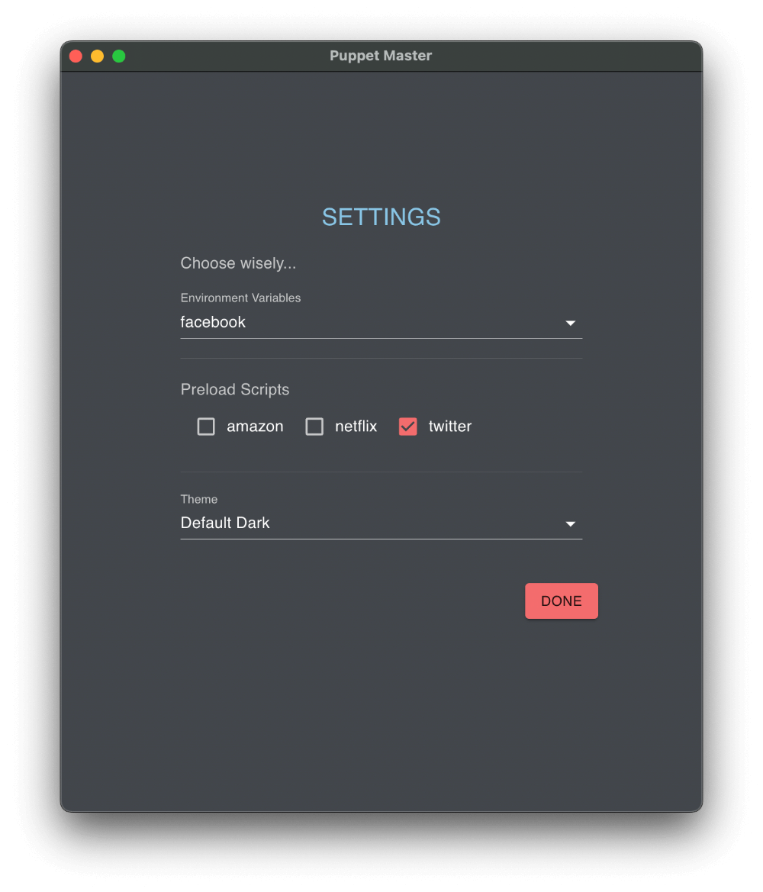

  

<h1 align="center" style="color: #00D7A0;">Puppet Master</h1>

Puppet Master combines browser automation with regular surfing! You can **use** the browser while automating it - and it makes doing that super easy! Never underestimate the value of convenience. Perfect for manual testing, webscraping and power users.

Download the APP now!

[MacOS M1 arm64](https://github.com/Mystagogue/puppet-master/releases/download/v1.0.0-beta1/Puppet.Master-1.0.0-beta1-arm64.dmg)

[MacOS Intel x64](https://github.com/Mystagogue/puppet-master/releases/download/v1.0.0-beta1/Puppet.Master-1.0.0-beta1-x64.dmg)

[Windows Portable](https://github.com/Mystagogue/puppet-master/releases/download/v1.0.0-beta1/Puppet.Master.1.0.0-beta1-win-portable.zip)

Note: The MacOS apps are code-signed, the windows app is not and you will need to allow it to run. The production version will be.

  

The app has a big red button. When you click this button it searches your computer for the first install of Chrome it can find, then it spawns an entirely **new** instance of Chrome. One that is brand new and has _no_ profile, _no_ history, _no_ cookies, _no_ cache, _no_ storage, _no_ prior memory of anything at all! If you click the button multiple times you will get **multiple** instances of Chrome, not just new windows new **instances** of the app, all of which are in complete **context isolation** from one another! This means you can sign into the same site with mutliple different users at the same time! The app connects to each instance via websocket and shows you a preview of its screen which updates automatically. When you close these instances, they are gone forever - no need to refresh browser cache again, just close the browser and start a new instance!

  

  

But theres more... There is a fully featured file system and a code editor. Any [puppeteer](https://pptr.dev/) automation code you write in the code editor can be executed on any of the new browsers you have created. There is no need to launch the browser as this is done for you and user input code is wrapped in an _async_ function so you can use the _await_ keyword immediately.

A [puppeteer](https://pptr.dev/) browser is created whenever you press the red button. As such a few variables are declared behind the scenes. They are _puppeteer_ (the puppeteer module), _browser_ (the puppeteer browser instance), _page_ (the first page of said browser) and _log_ (a plain old javascript object that you can add whatever you want to and it will be displayed in the output window). So you can use these names immediately in your code.

This really takes the hassle out of writing automations. Unlike regular test automation software you can keep using the browser as a regular manually surfing browser while doing this. Run as many scripts on a browser as you like, the scripts retain no memory of each other, only the browser persists! _Need to test something on the 3rd step of a multi-step form?_ Run an automation to get you there then keep going manually. You can run a whole file at a time, or just the currently selected code or you can even run whatever you have copied to your clipboard. Great if you want to test one line at a time, **the browser won't crash if the code fails**, the app will just give you a debug message and the browser will keep running so you can keep using it.

  

Theres even more... you can open any file you like to store your code, its just a regular file system like a code editor. Importantly you can run **npm init** on the directory and add node modules. Then when you use **require()** in the input code it will look inside the node_modules folder at the top level of the directory you opened! This code is running in a virtual machine inside a node child process so you have access to all the standard node modules as well as any modules you install. The file navigator hides the node_modules directory but it will show you the package.json. Do this with as many directories as you like to organise stuff. You have the full breadth of node packages at your disposal. You even have access to the file system - scrape a bunch of data from the web and save it to a file! Save it in the directory you have open and you will see it appear and you can view it in the code editor!

Add a fetch library, query the API for whatever data the you want and log it to the otuput window using the log object. I like to add an SQL package and read the user data from the database when I log in to a site so I can see if everything is as expected!

  

<!-- Whats in global scope? The app starts a browser for you. It creates the following global variables for you:

- browser (the current [puppeteer](https://pptr.dev/) browser instance)
- page (the first page of the current browser, browser.pages()[0])
- log (a POJO, you can log any data to this that you want)

These are the standard [puppeteer](https://pptr.dev/) objects. The page object has all the associated puppeteer methods, as does the browser. The log object is a plain old Javascript object (POJO). You can simply add any data to it you like.

i.e log.message = "hello world!"

For example when I use the code to log into a website, I use node mudules to reach out to the database and get the associated user record, then I log the data of that record to the log!

The log can be read inside the output window. The output window can be activated by clicking the icon in the side nave menu. You can drag the edge to make it larger or smaller (the same is true for any section fo the app). -->

There is even more than that... you can add environment variables and preload scripts as well. Any file you name with the extension **\*.env.js** will become an environment variable file and any file you name with **\*.preload.js** will become a preload script. You can then select them in the settings panel. The difference between the two is only 1 environment file can be selected at a time but you can select as many preload scripts as you like.

  

When the user input code is executed what happens is first the environment variables are executed, then each preload script in turn, then the current code file (or selected code) inside an async wrapper. The input code will then have access to everything added to scope in the environment and preload scripts. You can use these to create simplified methods for your input code. For example have a websiteX.preload.js and add a loginToWebsteX method. Then when writing other scripts you have a one line method to use. This way even non technical assets can read and use your code (when I say assets here I mean other human beings ar your company! The project managers, the QA's etc).

<!-- Theres even more... There are environment variables and preload scripts that allow you to create complex wrapper methods for your automation script meaning it is even easier and faster and more convenient to write. Since this app has an integrated file system you can store your automation code in multiple files, perhaps corresponding to each of your projects and have different environment variables and preload scripts for each.

There is even more... Any data can be extraced from the page and added to the "log" object. The log object is a POJO (Plain Old Javascript Object) that is in scope all the time. Just add properties to it as you like and they will be visible in the out put window. Perfect for Web Scraping!

There is even more...You can use the "require()" function in any of your scripts and it will look for a node_modules folder at the top level of the currently open folder. So you can create complex scripts. Why not look up the data for the current user in the database using the script, then log it to the output window WHILE you are browsing, so you have all the data you need to debug any problems with your site! -->

So how do you use the app? When you install the app open any directory on your file system and start creating code files! Using the right click will display a context menu. The contents of the menu depends which section fo the app you click on. In the file tree it will give you CRUD options. Hoevering the code editor it will give you options to execute code.

Why use this app instead of the 1,000,000 other ways of doing this kind of thing? Convenience. There is nothing with the same speed to power ratio as this. You can write powerful code quickly. Even if you have 100% automated test coverage you can never get around the need to manually test. What do you do when you are in the process of building a new feature? No test exists yet! What if you have to triage bugs? This app **will** save you countless hours!

_Puppet Master is a desktop app built with Electron and React._
